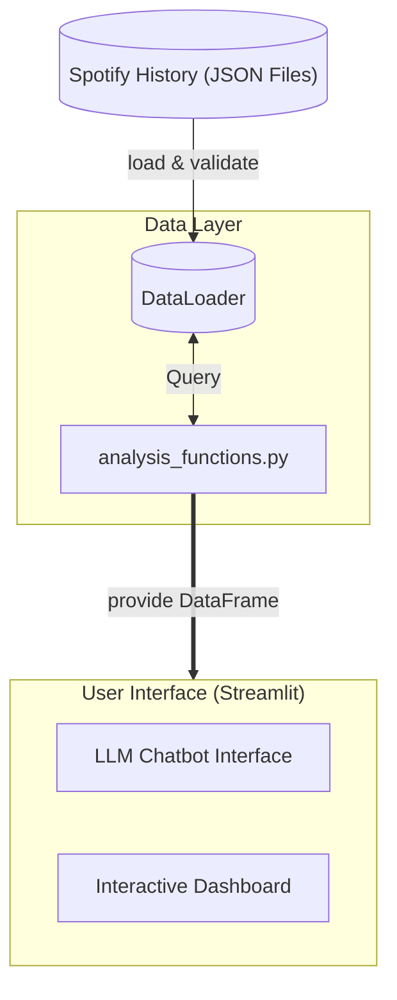
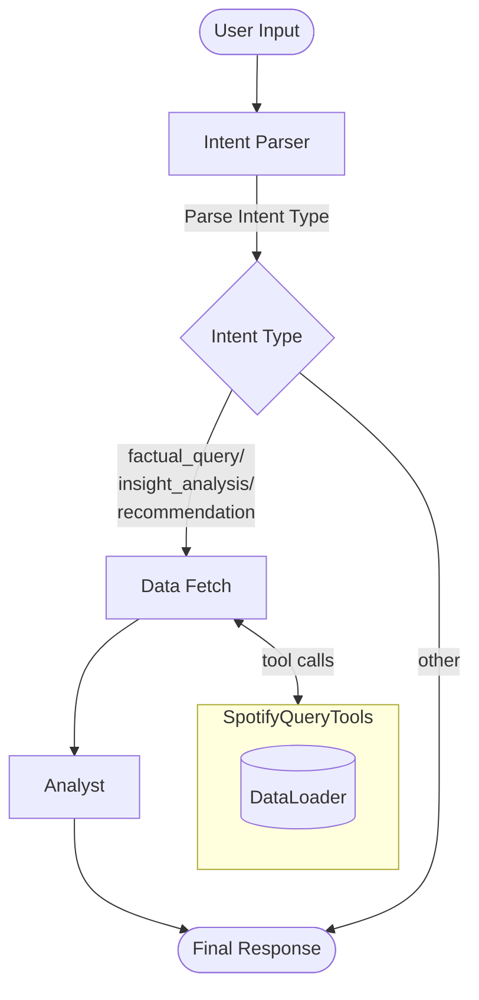

# Spotify AI Analytics Agent

[](https://spotify-ai-analytics-test.streamlit.app/)

## Requirements at a Glance

| Requirement | Description | How to Obtain |
| :--- | :--- | :--- |
| **Spotify Data** | Extended Streaming History (JSON files) | Request via [Spotify Privacy Settings](https://www.spotify.com/account/privacy/). Process may take a few days. |
| **API Key** | OpenAI or Google Gemini key | Generate via [OpenAI Platform](https://platform.openai.com/) or [Google AI Studio](https://aistudio.google.com/). |

### *Privacy Note*
Your data is processed within your active session. This application does not store your Spotify history or API keys on a permanent server. All computations are performed using the keys you provide in the sidebar.

## Overview
This project is a Python application for analyzing personalized Spotify streaming history. It combines an LLM-powered chatbot with an interactive dashboard to provide deep insights into listening habits, trends, and music recommendations.

## Core Features

### AI Chatbot
Interactive agent built with LangGraph that understands natural language queries.
- Query historical facts (e.g., "What were my top 5 artists in 2023?").
- Analyze listening taste (e.g., "How my musical taste for last 6 month?").
- Get recommendations based on specific timeframes or genres found in your history (e.g., "Recommend some new artists for me according to my preference in last year.").

### Interactive Dashboard
Visual summary of streaming data using Plotly.
- **Track Insights**: Comprehensive views of most-played tracks, artists, and albums.
- **Temporal Analysis**: Visualizations of listening patterns across days, months, and years.
- **Interactive Filtering**: Zoom and filter data points directly within the charts.

---

<details>
<summary><strong>Technical Architecture and Local Setup</strong></summary>

### System Architecture
The application follows a modular design separating data ingestion, computational logic, and AI orchestration.

1. **DataLoader (dataloader/)**: Handles file discovery, JSON parsing, and schema validation using Polars and Pydantic.
2. **Analysis Core (analytics/)**: A functional layer containing all computational logic, decoupled from the UI and storage.
3. **AI Agent (spotify_agent/)**: Orchestrates multi-step reasoning using LangGraph, wrapping the Analysis Core into tools for the LLM.

#### System Flow Diagram

### Data Pipeline & Analysis Logic
The project implements a strict separation between data state, computational logic, and orchestration. All functional analysis is centralized in `analysis_functions.py`, offering a clean endpoint for both the Dashboard and the AI Agent.
### LLM Chatbot Implementation
The chatbot uses LangGraph to orchestrate a specialized process for accurate data retrieval and natural language synthesis.

#### Agent Logic Diagram


### How to Run Locally

1. **Prerequisites**: Ensure Python 3.13+ and `uv` are installed.
2. **Install Dependencies**:
   ```bash
   uv sync
   ```
3. **Prepare Data**: Place your Spotify JSON files in the `data/spotify_history/` directory.
4. **Configure Environment**:
   - Copy `.envtemplate` to `.env`.
   - Add your `GEMINI_API_KEY` or `OPENAI_API_KEY`.
5. **Launch**:
   ```bash
   uv run streamlit run src/app/main_page.py
   ```

</details>

## Project Structure
```text
spotify-ai-analytics/
├── data/               # Raw Spotify JSON exports
├── src/
│   ├── app/            # Streamlit UI (Chatbot & Dashboard)
│   ├── spotify_agent/  # LangGraph orchestration & AI logic
│   ├── dataloader/     # Data ingestion & Polars transformation
│   └── analytics/      # Centralized analysis & plotting logic
├── tests/              # Unit and integration test suite
└── doc/                # Documentation and design plans
```

## Limitations
- LLM responses are experimental and may occasionally hallucinate details.
- Currently optimized for Spotify Extended Streaming History format specifically.
    - Cannot acces realtime data beyond uploaded files.
