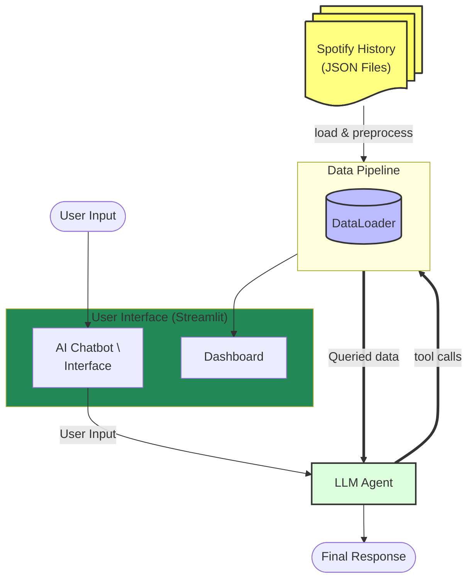
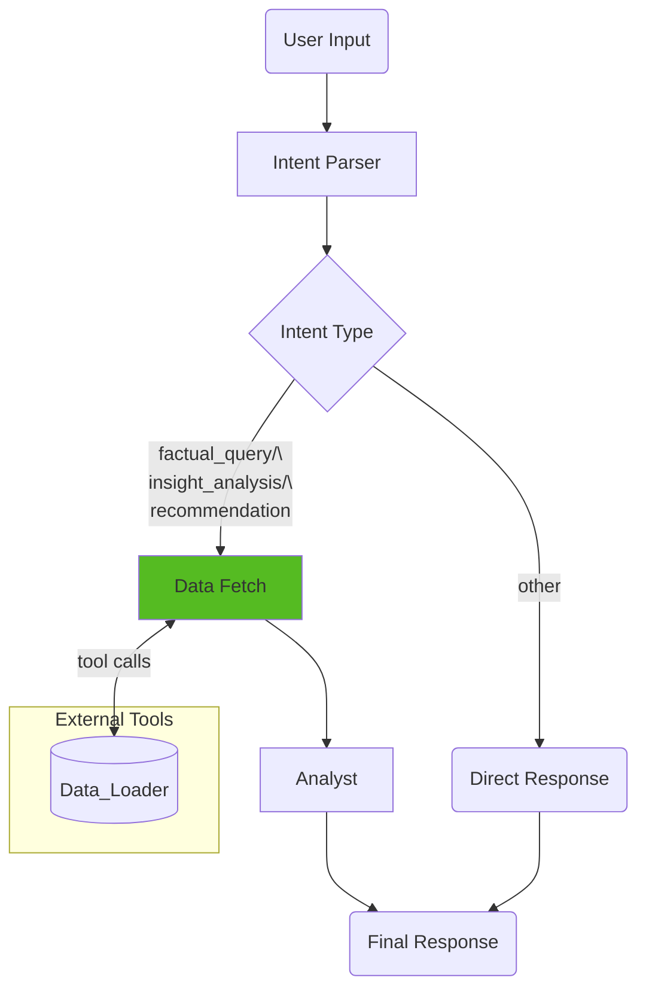

# Spotify AI Analytics Agent

## Overview

This project provides a locally runnable Python application for analyzing personalized Spotify streaming history JSON files.

It includes an LLM-powered chatbot that parses user intent from natural language inputs, calling structured data analysis tools, and generates responses based on retrieved data. 

It also features an interactive dashboard that visualizes and summarizes top artists/tracks, and temporal patterns.

## User Interface

The application uses `Streamlit` as a unified interface, displaying two primary modes:
- **Chatbot Page**: Interact with an AI agent using natural language to query your history or get music recommendations.
- **Dashboard Page**: View interactive trends, top artists, and listening patterns through high-fidelity charts.

For setup and execution details, see the [How to Run](#how-to-run) section.

## System Architecture
The system is built on a modular architecture that separates data ingestion, visualization, and AI orchestration.

1. **DataLoader**: Ingests raw Spotify JSON files, validates fields, and stores data in optimized `polars.DataFrame` structures.
2. **Dashboard**: Provides a visual layer using `Plotly` to render interactive charts and trend analysis.
3. **AI Agent**: Uses **LangGraph** to coordinate multi-step reasoning, tool execution, and contextual response generation.



### Data Pipeline
The data pipeline focuses on performance and reliability using `Polars` and `Pydantic`. An customized data loader `SpotifyDataLoader` handles ingestion and validation.
- **Ingestion**: Efficiently reads multiple Spotify history JSON files into `Polars.DataFrame`.
- **Validation**: Uses Pydantic models to ensure data follows Spotify extended history.
- **Analysis Logic**: Core analysis functions are centralized in `analysis_functions.py`, offering a clean endpoint for both the Dashboard and the AI Agent.

### Visualization & Dashboard
The dashboard offers a no-code way to explore your data through interactive visualizations.
- **Interactive Charts**: Powered by `Plotly` for zooming, filtering, and detailed tooltips.
- **Track Insights**: Deep dives into your most-played tracks, artists, and albums.
- **Time Analysis**: Specialized views for tracking listening habits over days, months, and years.

### LLM Chatbot & Tooling
The chatbot is built using **LangGraph**, orchestrating a specialized three-stage process to ensure accurate data retrieval and high-quality conversation.



#### Components and Nodes

- **Intent Parser**: Classifies user requests into categories: `factual_query`, `insight_analysis`, or `recommendation` to define the execution strategy.
- **Data Fetch**: Translates the strategy into specific tool calls, managing argument generation and data truncation to fit LLM context windows.
- **Analyst**: Synthesizes retrieved data into a final response using personas tailored to the user's intent.


## How to Run
Follow these steps to set up the project locally and start exploring your data.

1. **Install Dependencies**: Ensure you have `uv` installed, then run the sync command.
   ```bash
   uv sync
   ```
2. **Prepare Data**:
   - Request your extended streaming history from [Spotify](https://www.spotify.com/account/privacy/) (the file should be JSON format).
   - Place all JSON files in the `data/spotify_history/` directory.
3. **Configure Environment**:
   - run `copy .envtemplate .env`.
   - Add your `GEMINI_API_KEY` or `OPENAI_API_KEY` in `.env`.
4. **Launch Application**:
   ```bash
   uv run streamlit run src/app/main_page.py
   ```

## Project Structure
```bash
spotify-ai-analytics/
├── data/               # Raw Spotify JSON exports
├── src/
│   ├── app/            # Streamlit UI (Chatbot & Dashboard)
│   ├── spotify_agent/  # LangGraph orchestration & AI logic
│   ├── dataloader/     # Data ingestion & Polars transformation
│   └── analytics/      # Centralized analysis & plotting logic
├── tests/              # Unit and integration test suite
└── doc/                # Documentation and design plans
```

## Limitations

- LLM responses are not yet systematically evaluated and may hallucinate in edge cases
- The application currently only supports local execution
- Model selection and API keys are configured manually via environment variables

## Roadmap

- Improve observability and robustness of LLM tool usage
- Refactor data access and tool abstractions for better modularity
- Explore lightweight deployment options
- Support options for user uploading data via the UI