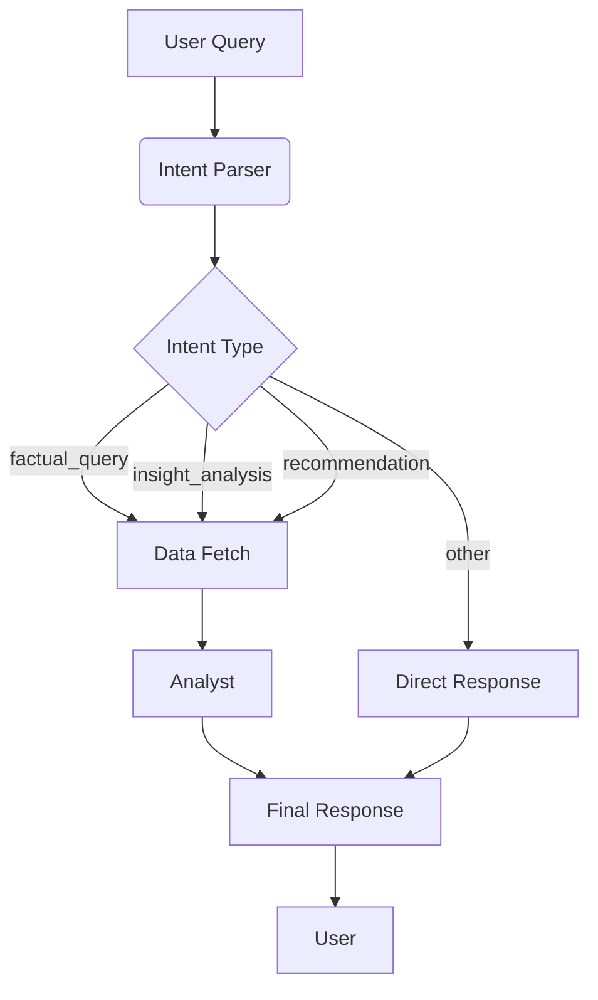

## Spotify Chatbot

### Overview
This module implements a chatbot that leverages LLMs to answer user queries about their Spotify listening history. It uses preprocessed data and analysis functions from the analytics module to provide insights.
### Key Features
- **Natural Language Queries**: Users can ask questions in plain English about their listening habits.
- **Retrive User Data**: The chatbot retrieves relevant data from the user's Spotify history.
- **Insightful Responses**: Provides detailed answers, trends, and recommendations based on user data. Curerently supports three main types of intents:
    1. `factual_query`: simply data retrieval and summary given the user query. No extra guessing and analysis.
    2. `insight_analysis`: Simple analysis (e.g., top artists, listening trends) based on user query and retrieved data. May generate some description about user's listening habits.
    3. `recommendation`: Provide personalized music recommendations based on user's listening history and preferences. This may involve more complex analysis and pattern recognition.

    4. `other`: It jusct catch all other annoying queries that are not related to the data

### Current Status
The chatbot is fully functional as a LangGraph agent. Major milestones completed:
- [x] **Strategic Intent Parsing**: Implemented a two-stage planning process (Plan -> Execute -> Analyze).
- [x] **Robust Data Retrieval**: Multi-tool execution with automatic argument generation, retry logic, and result truncation.
- [x] **Persona-based Synthesis**: Tailored system prompts for different user goals (Facts vs. Analysis vs. Recommendations).
- [x] **Production-ready Logging**: Integrated with a file/console logging system that handles UTF-8 (Windows compatible) and captures node-level monitoring.
- [x] **Mocking & Testing**: Comprehensive integration tests with mocked LLMs for reliable verification.

### Quick Start

To run a simple demonstration of the chatbot, ensuring your environment variables (like `OPENAI_API_KEY` or `GEMINI_API_KEY`) are set in a `.env` file:

```bash
# Using uv (recommended)
uv run python examples/main.py

# Or using standard python
python examples/main.py
```

This will invoke the agent with a sample query like *"Show me my top 5 artists and tracks from January 2024"* and print the structured analysis.

### Local GUI

To launch a local Streamlit-based GUI for interacting with the chatbot, run:

```bash
uv run streamlit run src/app/main_gui.py
```

## Graph Workflow

The chatbot is built using **LangGraph**, orchestrating a specialized multi-step process to ensure data accuracy and conversational quality.



### Components and Nodes

1.  **Intent Parser**: The brains of the operation. It classifies the user's request into one of four categories (`factual_query`, `insight_analysis`, `recommendation`, or `other`) and selects which tools (e.g., `get_top_artists`) will be needed. It provides the "Strategy" for the rest of the graph.
2.  **Data Fetch**: A tool specialist node. It takes the strategy from the Parser, uses an LLM to generate precise arguments for the selected tools (like date ranges), and executes them. It handles errors with retries and truncates large data sets to protect the LLM's context window.
3.  **Analyst**: The final synthesizer. It takes the raw data retrieved by the Fetch node and crafts a response using a persona tailored to the intent:
    -   *Fact Checker* for `factual_query`.
    -   *Music Critic & Data Analyst* for `insight_analysis`.
    -   *Recommendation Expert* for `recommendations`.

## Plans for Next Steps

- **Temporal Features**: Implement `get_listening_by_time` to answer "When do I listen most?".
- **Contextual Memory**: Add state management for conversational history and threads.
- **Local UI**: Build a Streamlit-based local dashboard and chat interface.
    - Examples:
        - https://llm-examples.streamlit.app/?ref=streamlit-io-home-llms
        - https://demo-ai-assistant.streamlit.app/?ref=streamlit-io-home-llms
- **External Metadata**: Integrate with the Spotify Web API for genre and detailed artist information.
